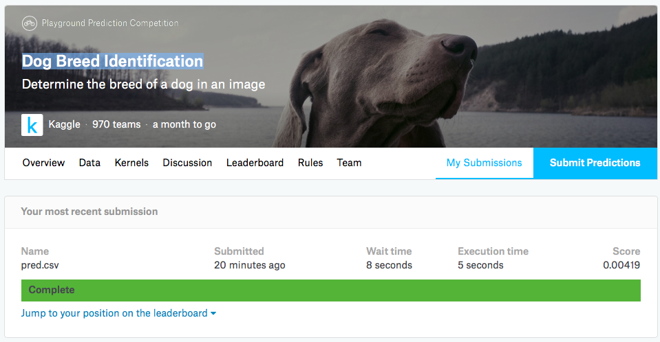

### kaggle: Dog Breed Identification

这部分所有代码均以@ypw 杨培文的代码为基础，具体请见培神的[github](https://github.com/ypwhs/DogBreed_gluon)，感谢培神的无私奉献。

由于培神原来的代码我的小机器实在难以跑动，很多地方卡内存和显存，所以我在培神代码的基础上做了一些杂乱的改变和精简。实现是基于单GTX1070的，多卡或者其他配置可能需要一定的改动。

复现结果仅需下载以下数据集，并解压到notebook所在的文件夹（同一目录下），按顺序运行notebook即可，若抽取feature部分卡内存或显存，可以将两个抽取feature的部分分别运行，运行完一部分后restart跑另一部分。

- kaggle比赛数据集：官网的4个文件均需要
- [Stanford Dogs Dataset](http://vision.stanford.edu/aditya86/ImageNetDogs/main.html)：仅需Images即可(http://vision.stanford.edu/aditya86/ImageNetDogs/images.tar)

比赛结果：未结束，可能会有更新

- 未使用Stanford数据集：代码略，可参见培神的代码

  

- 使用了Stanford数据集：

  
